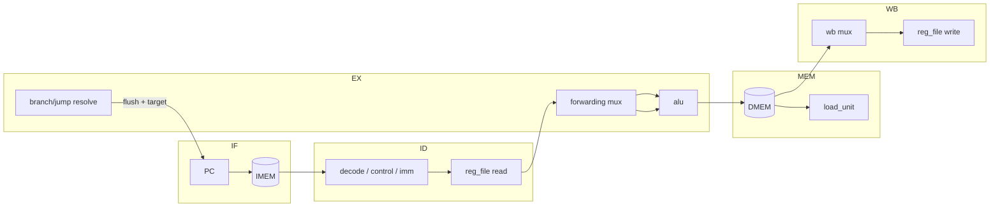

# 5-stage pipelined core (`rv32i_pipeline`)

Classic RISC pipeline: **IF → ID → EX → MEM → WB**, one instruction issued per
cycle in steady state. Same building blocks and same external memory interface
as the single-cycle core; the difference is four sets of pipeline registers plus
hazard logic.



## Pipeline registers

| Register | Carries |
|----------|---------|
| IF/ID  | `pc`, `pc+4`, `inst` |
| ID/EX  | all control bits, `pc`, `pc+4`, `imm`, `rs1_data`, `rs2_data`, `rs1`, `rs2`, `rd`, `funct3`, `funct7[5]` |
| EX/MEM | control (mem/wb/reg_write), `alu_result`, forwardable result, store data, `rd`, `funct3` |
| MEM/WB | `wb_sel`, non-memory result, load data, `rd`, `reg_write` |

## Hazards

### 1. Data hazards — forwarding (`forwarding_unit`)
Back-to-back dependent instructions are resolved in EX by steering the freshest
producer value onto each operand:

- `fwd = 10` — forward from **EX/MEM** (most recent, highest priority)
- `fwd = 01` — forward from **MEM/WB**
- `fwd = 00` — use the register-file value

The EX/MEM forward source is the instruction's *resolved* writeback value
(ALU result / PC+4 / immediate), so producers like `LUI`, `JAL`, `JALR`,
`AUIPC` forward the correct value one instruction later — not a stale ALU
result.

### 2. WB→ID same-cycle hazard — ID forwarding
The register file is plain (no write-first bypass, to avoid the single-cycle
combinational loop). So a value written back this cycle is not yet visible to
the instruction reading in ID. A small mux in ID bypasses `wb_data` straight
into the read when `wb_rd == id_rs`.

### 3. Load-use hazard — one-cycle stall (`hazard_unit`)
A load's data is not ready until the end of MEM, one cycle too late for an
immediately dependent instruction in ID. When the instruction in EX is a load
whose `rd` feeds either source of the instruction in ID, the pipeline stalls one
cycle: **freeze PC and IF/ID, bubble ID/EX**. Next cycle the value is available
by EX/MEM forwarding.

```
    lw   x9, 0(x0)     IF ID EX MEM WB
    addi x12, x9, 1        IF ID -- EX MEM WB     <- 1 stall, then forward
```

### 4. Control hazards — resolve in EX, flush 2
Branches and jumps resolve in **EX** using forwarded operands. On a taken
transfer the two younger instructions already in IF/ID and ID/EX are flushed to
bubbles and the PC is redirected to the target — a **2-cycle penalty**. No
branch prediction; not-taken is the implicit (and free) fall-through.

```
    beq  x1, x1, T    IF ID EX MEM WB
    (fetched)             IF ID  x            <- flushed
    (fetched)                IF  x            <- flushed
    T: ...                       IF ID EX ...
```

## Correctness

`sim/tb_pipeline.sv` runs the same program as the single-cycle testbench and
checks the register file reaches the identical end-state, exercising: EX
forwarding (dependent ALU chain), the WB→ID path, a load-use stall
(`addi x12, x9, 1` after `lw x9`), a taken branch, and a jump (both flushes).
Both cores report `ALL PASS`.
