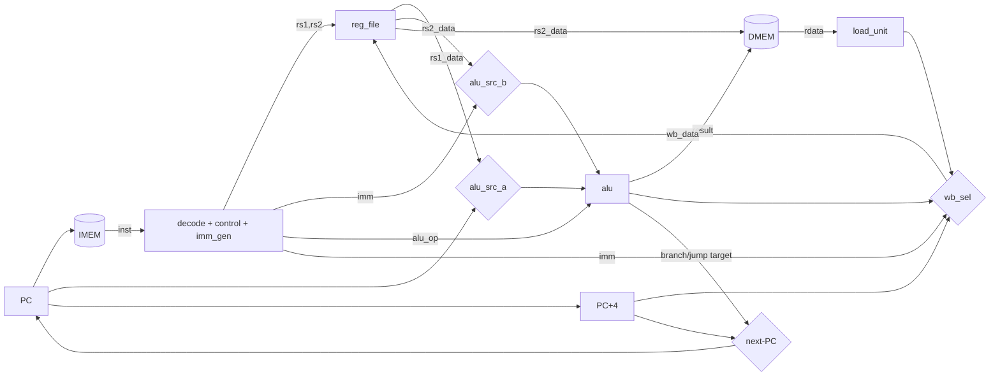

# Single-cycle core (`rv32i_single_cycle`)

One instruction is fetched, executed, and retired every clock. The entire
datapath is combinational except two pieces of state: the **PC** and the
**register file**, both updated on the rising clock edge. Data memory is
external and combinational-read.

## Datapath



## Next-PC logic

```
pc_plus4      = pc + 4
branch_target = pc + imm            (B-type offset, also JAL)
jalr_target   = (rs1 + imm) & ~1

next_pc = jump                  ? (jalr ? jalr_target : branch_target)
        : (branch & branch_take)? branch_target
        :                         pc_plus4
```

`branch_take` comes from `branch_unit`, which compares `rs1`/`rs2` directly, so
all six branch conditions (including signed vs unsigned) are correct without
routing the comparison through the ALU.

## Writeback source (`wb_sel`)

| wb_sel | source | used by |
|--------|--------|---------|
| `WB_ALU` | ALU result | R/I ALU ops, AUIPC |
| `WB_MEM` | `load_unit` output | loads |
| `WB_PC4` | PC+4 | JAL, JALR (link) |
| `WB_IMM` | immediate | LUI |

## Why the register file has no write-first bypass

Reads are asynchronous and the write commits on the clock edge. In one cycle an
instruction reads its operands (old values) and writes its result (new value) —
correct RISC semantics. A write-first bypass would instead feed the *current*
instruction's result back into its own operand read, e.g. `ADD x1, x1, x2`
forms `rs1 → wb → rs1`, a **combinational loop**. So the register file stays a
plain read/write; the pipeline handles same-cycle WB→ID hazards with explicit
forwarding instead (see [`pipeline.md`](pipeline.md)).

## Critical path

Everything is in series in one cycle:

```
PC → IMEM → decode → reg read → ALU → DMEM → load extract → writeback mux → reg
```

This is the classic single-cycle trade-off: simple and correct, but clock
period is set by the slowest instruction (a load). The pipeline addresses this.
